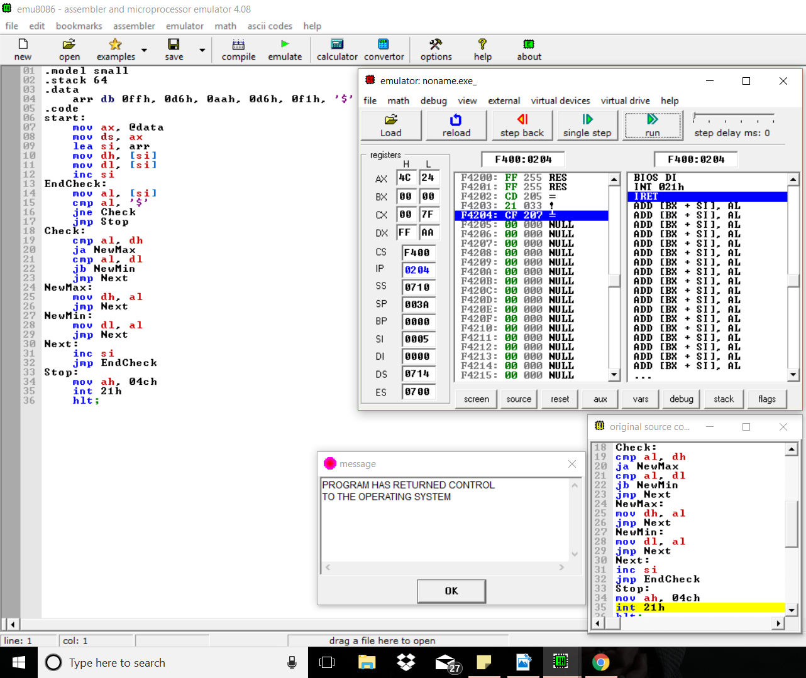
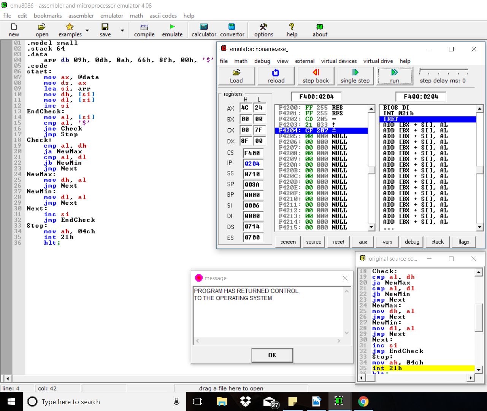
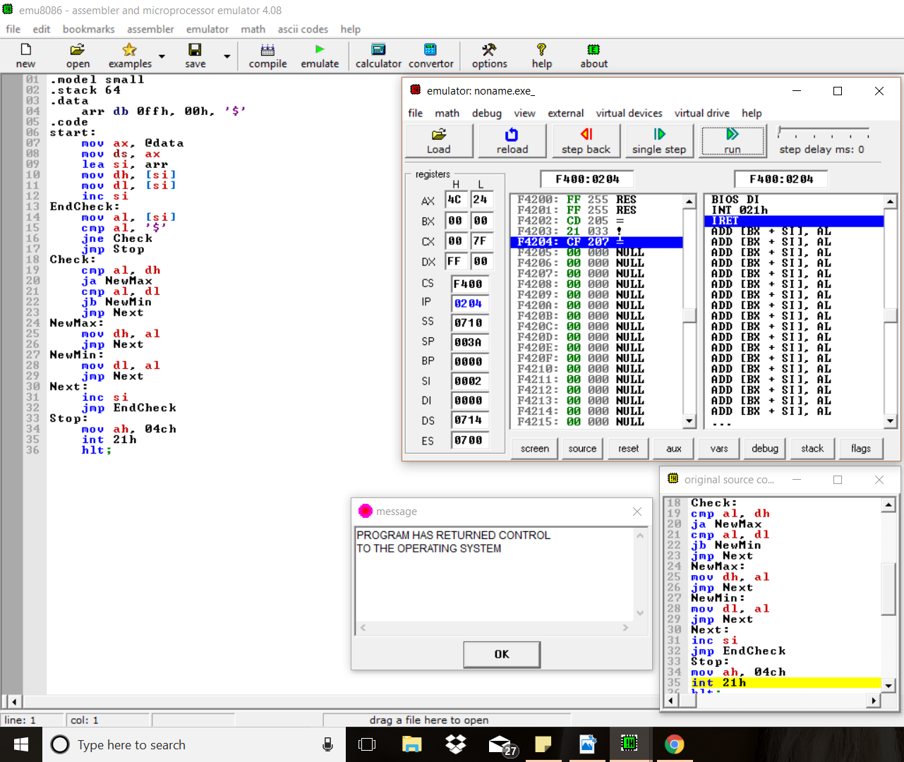
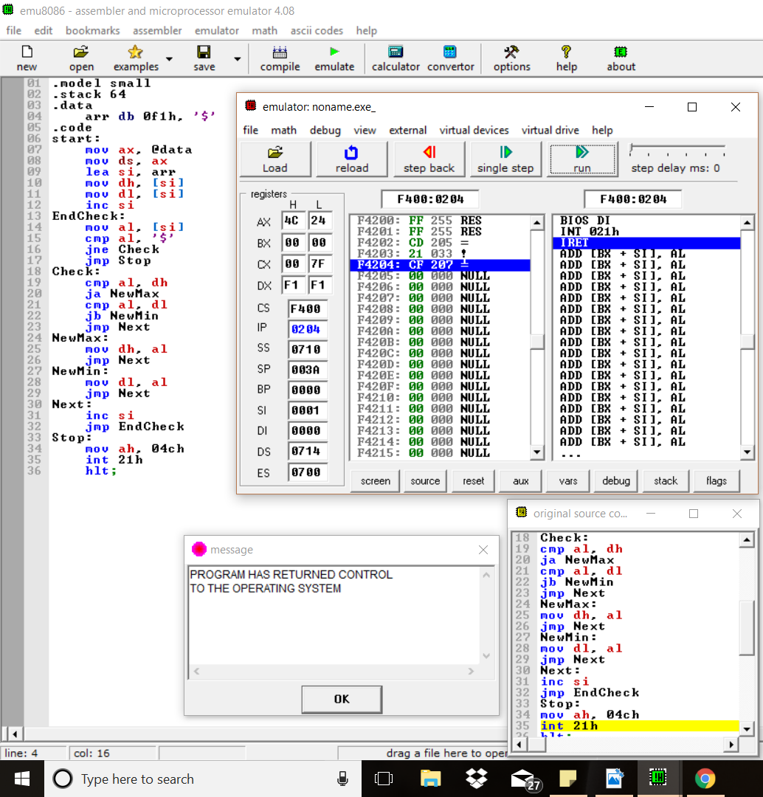

# Question
Find the minimum and maximum from an input array of hexadecimal numbers. Store the results in DL and DH registers respectively.

# Note
'$' has been used to denote the end of the array.

# Examples
* ### Find min max
  

* ### Find min max
  

* ### Find min max
  

* ### Single element in input array
  
