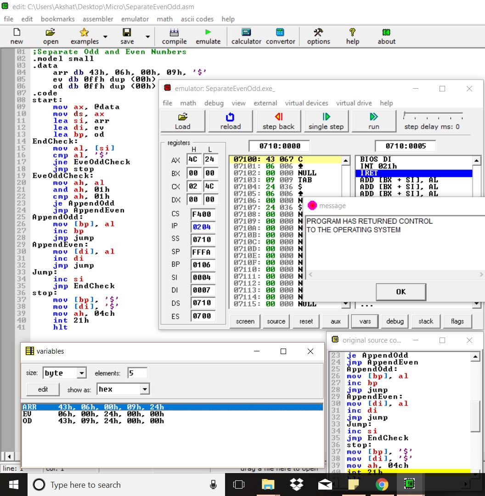
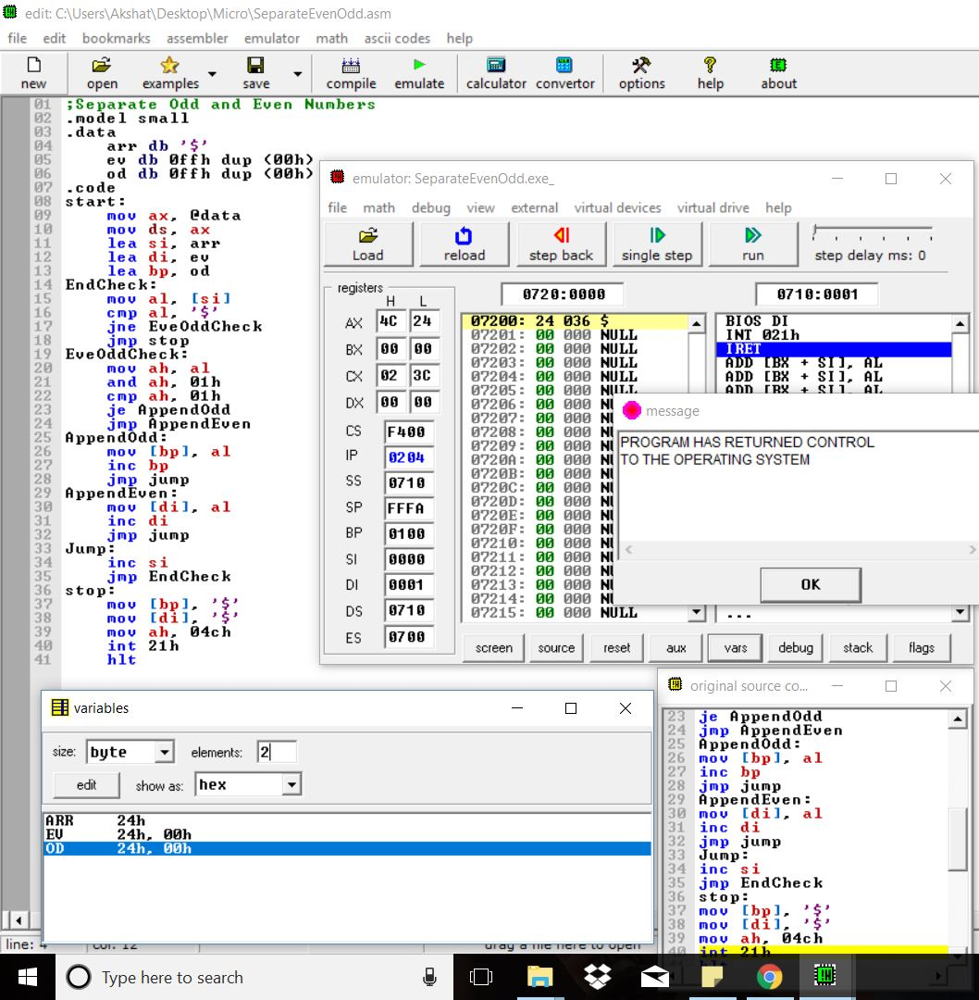
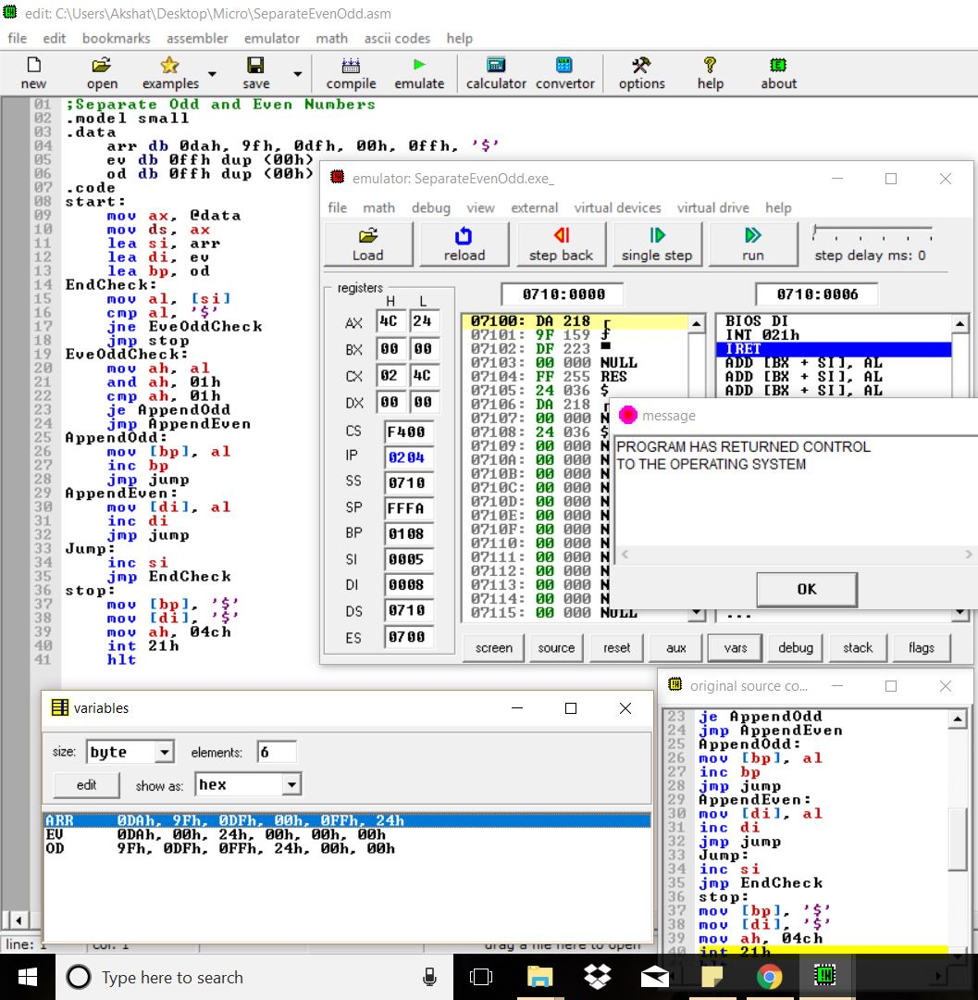

# Question
Separate the odd and even numbers from a given input array.

# Note
'$' (ascii = 24h) has been used to denote the end of the array.

# Examples
* ### Separate given list
  

* ### When empty array is given as input
  

* ### Separate given list
  
