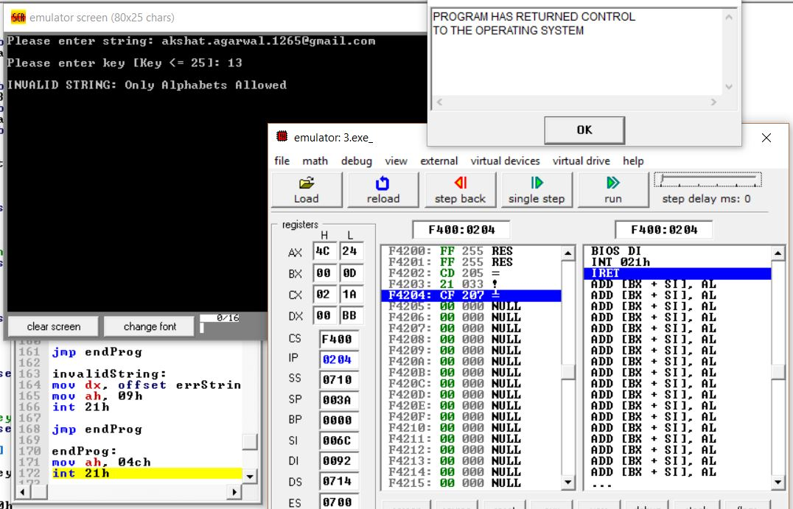
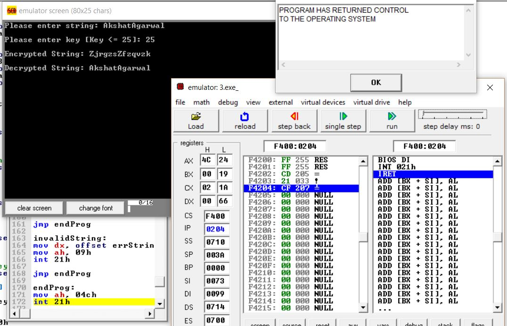
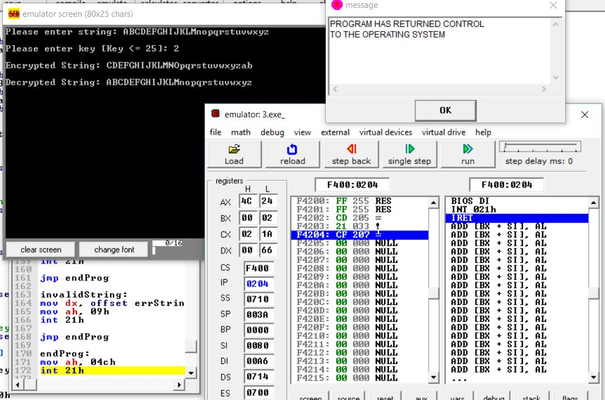
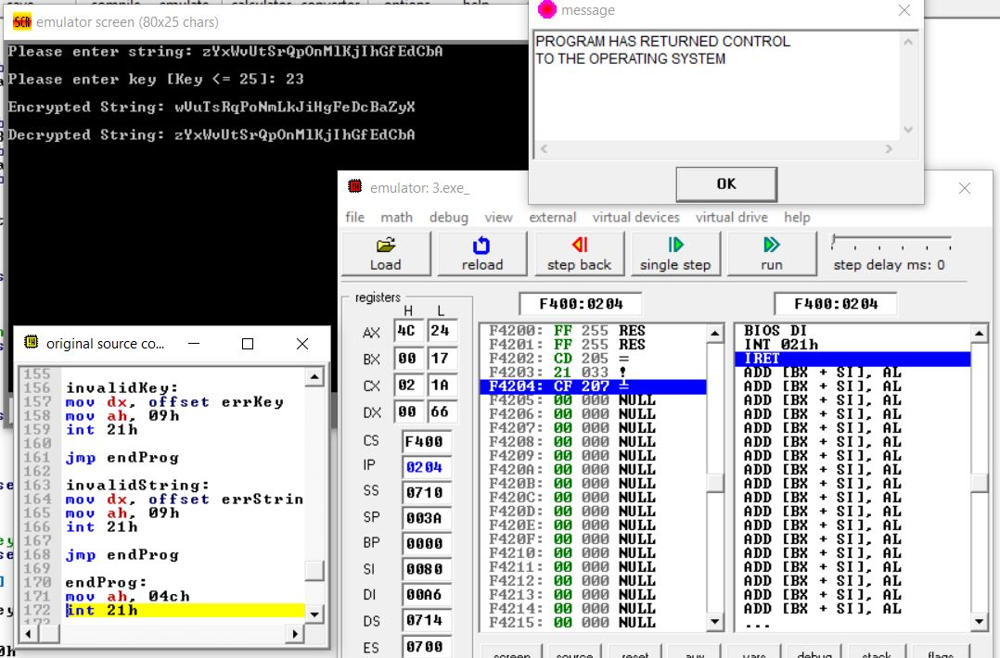

# Question
Read a string from the user using interrupts. Use Ceaser's cypher to encrypt the given string. Encryption key (displacement) should be read from the user. Display both encrypted and decrypted string.

# Examples
* ### Invalid string
  

* ### Key = 25
  

* ### Key = 2
  

* ### Key = 23
  
