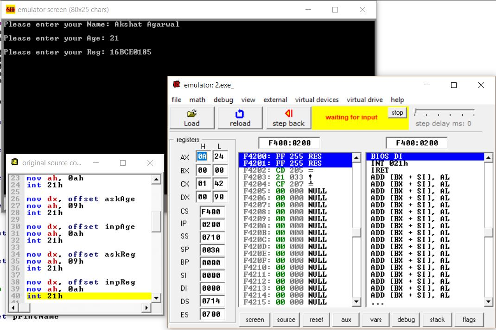
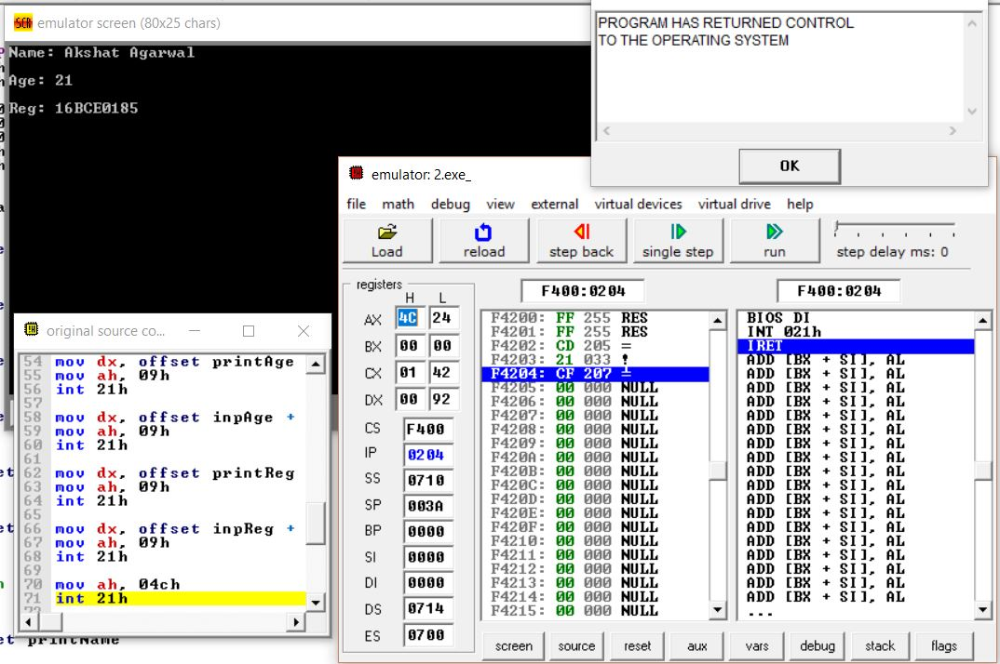

# Question
Prompt the user for name, age, registration number from the keyboard and display it on the screen. Clear the entire screen before the display.

# Example
### Prompt and get user input
  

### Clear screen and display info
  
