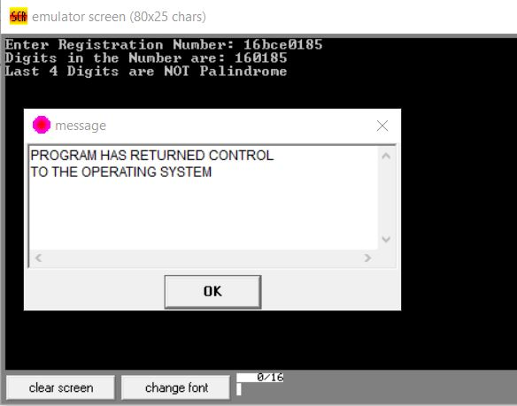
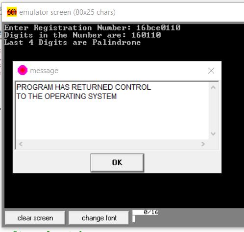
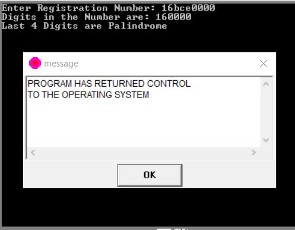

# Question
Write a program that uses different data segments to read and store your registration number as string input using interrupts. Extract and print digits. Check for palindrome (last four digits).

# Note
'$' has been used to denote the end of arrays and strings.

# Examples
* ### Not Palindrome
  

* ### Palindrome
  

* ### Palindrome
  
