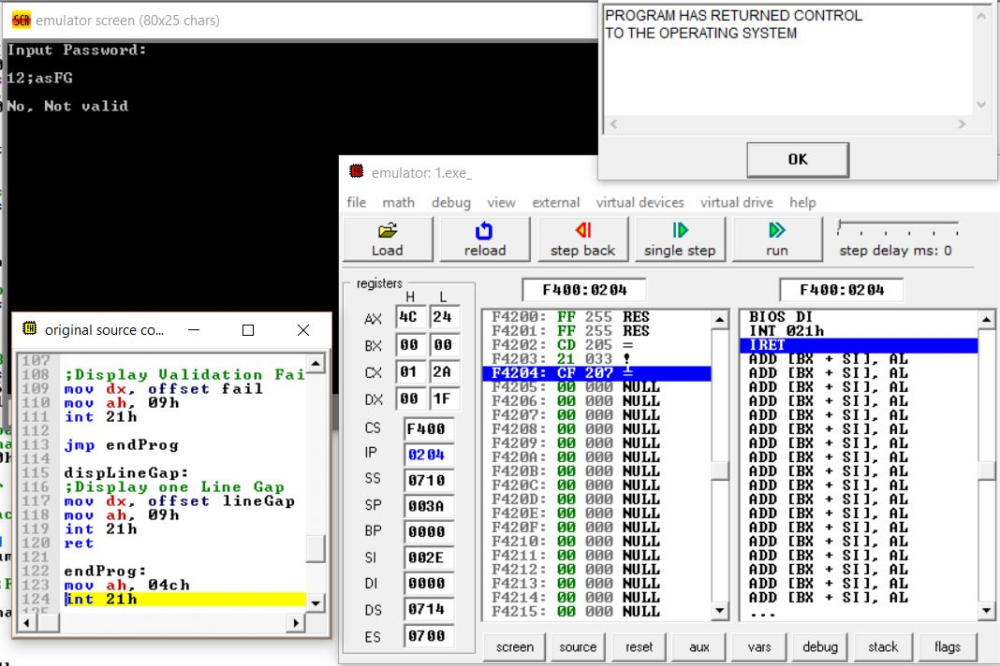
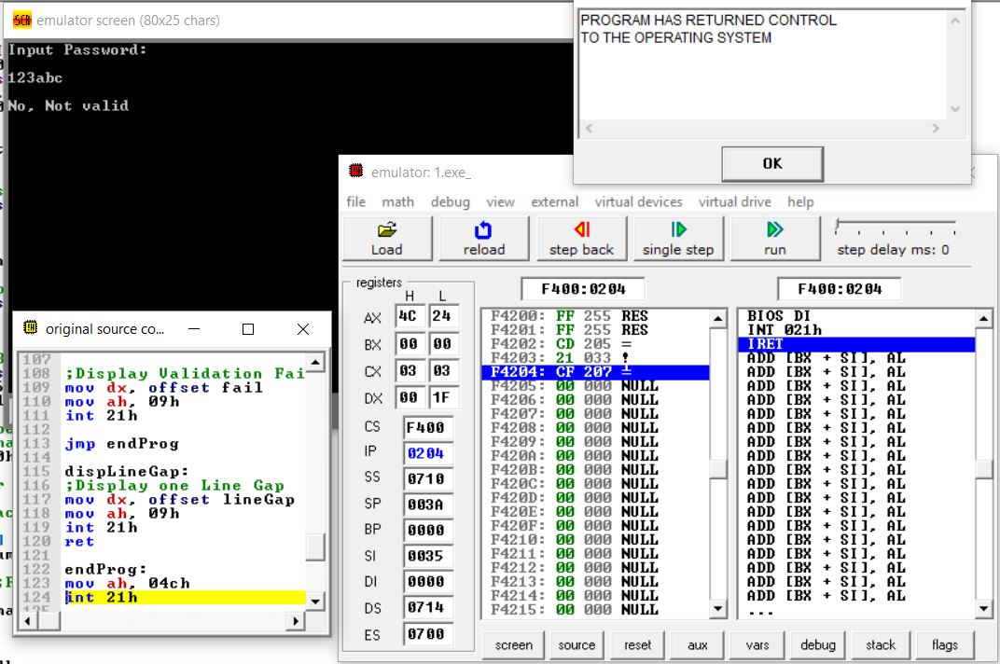
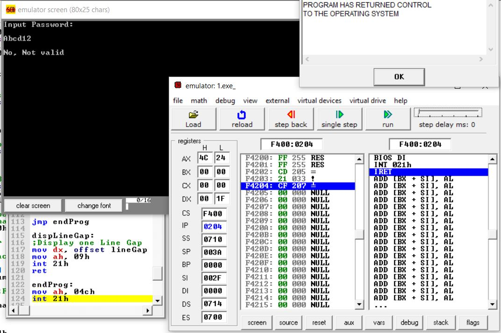
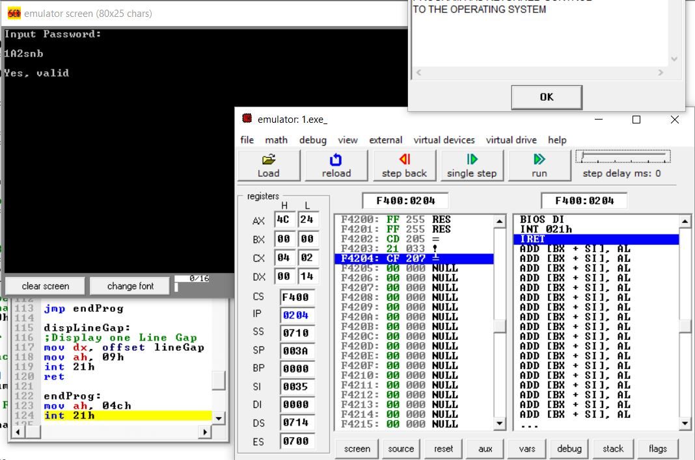

# Question
A password requires 4 alphabets and two numbers. It should start with a number. Number of characters must be six. Read a password string from the user using interrupt, and check if it is a valid password combination. Print “Yes, valid” or “No, Not valid” on the screen.

# Examples
* ### Invalid password
  

* ### Invalid password
  

* ### Invalid password
  

* ### Valid password
  
