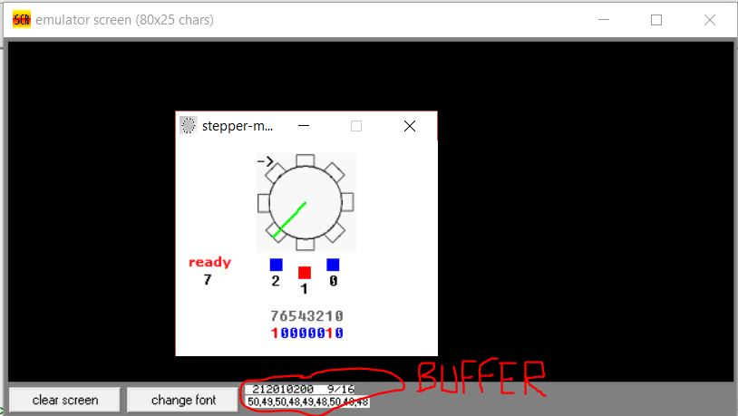
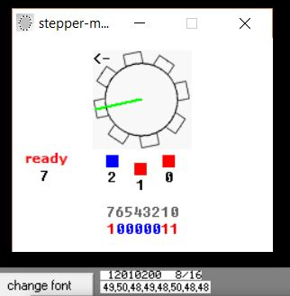
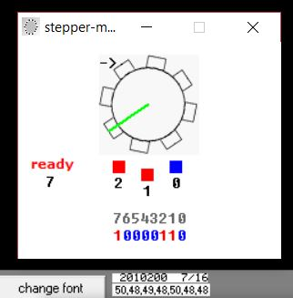
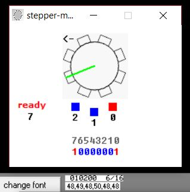
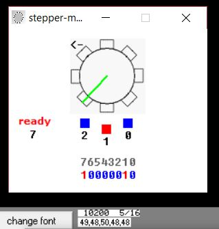
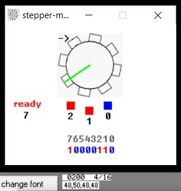
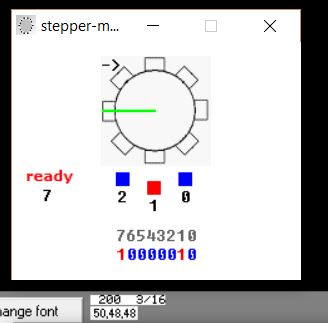
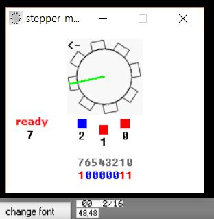
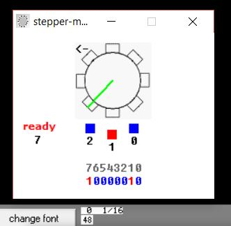
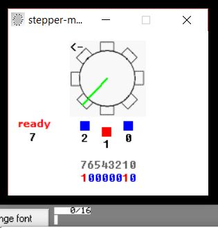

# Question
Write a program to drive a stepper motor forward continuously when user inputs '1', backward when '2', and idle when '0'. User input is received in serial port. Stepper motor is connected via parallel port.

# Note
Keyboard buffer is read one at a time after each half-step.  
2 will make it AntiClock, 1 will make it Clock, 0 will make it IDLE.

# Example
* ### Keyboard Buffer Sequence - 212010200  
Displayed Stepper after each Buffer Char is read.  
Motor Direction can be seen as an arrow on top left of motor.  
Keyboard Buffer can be viewed at the bottom.  

### Initially Moving Clockwise
  

  

  

  

  

  

  

  

  

  

### Buffer is Empty now. Motor was Idle at last. It stays Idle until buffer gets another character Input.
