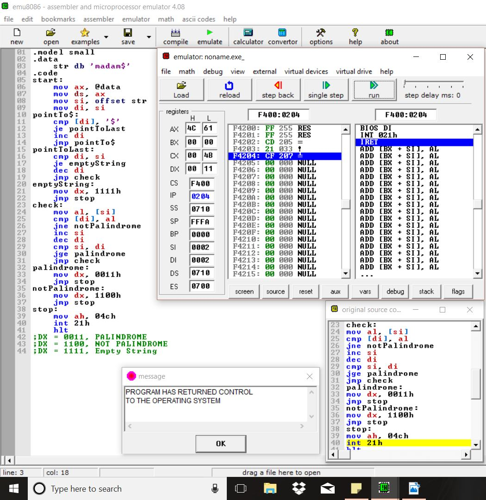
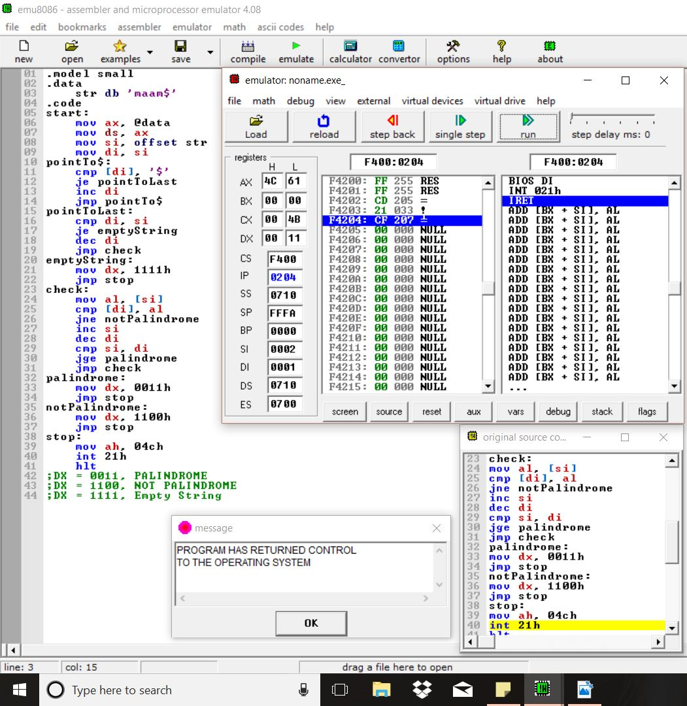
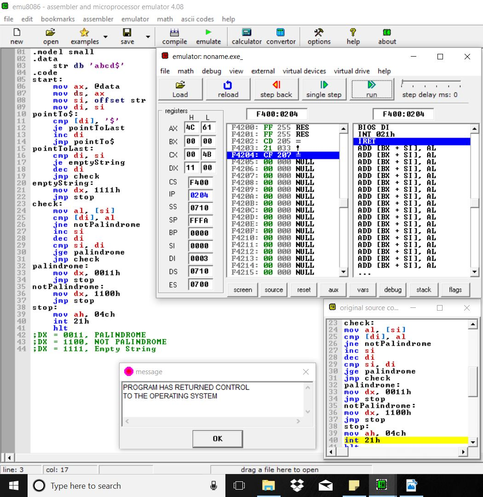
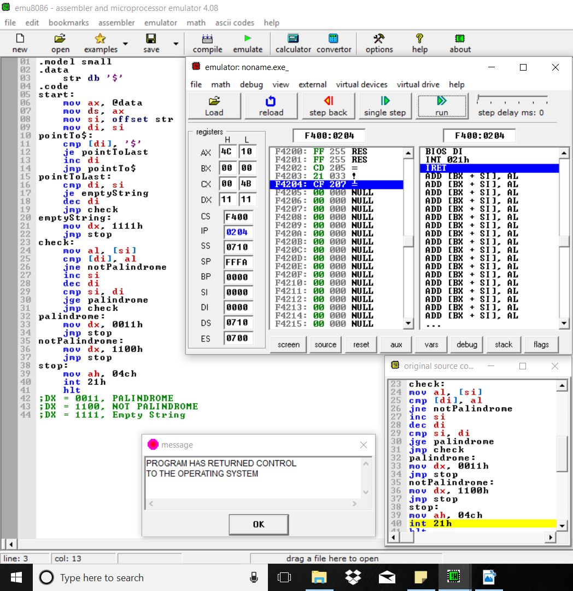

# Question
Check if a given string is a palindrome or not.

# Note
'$' has been used to denote the end of the string.

# Examples
* ### Odd length Palindrome
  

* ###  Even length Palindrome
  

* ### Odd length not Palindrome
  

* ###  Even length not Palindrome
  

* ### Single alphabet
  

* ### Empty strinng
  
